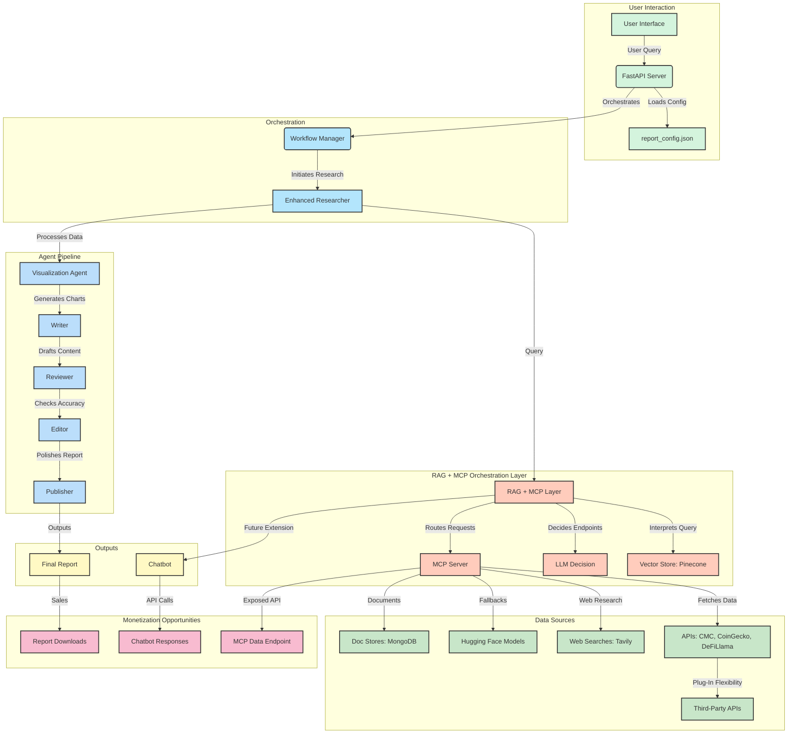

Let’s design a detailed plan to integrate the RAG > MCP tier into your updated XplainCrypto architecture. This design will focus on building MCP clients and servers for your retriever services (CoinMarketCap, CoinGecko, DeFiLlama, Hugging Face, Tavily), incorporating RAG with Pinecone for intelligent query routing, and ensuring flexibility for future resources (e.g., document stores, additional APIs, databases). The plan will be structured for your AI developers, with clear, testable steps, while ensuring your existing agent layer (Enhanced Researcher, Visualization Agent, etc.) continues to function seamlessly.

---

### Design Plan: Integrating RAG > MCP Tier into XplainCrypto

#### Overview
The goal is to create a new `RAG + MCP Orchestration Layer` that acts as an intelligent intermediary between your agent layer and retriever services. RAG (Retrieval-Augmented Generation) will use Pinecone to store metadata about available MCP endpoints, enabling dynamic query routing. MCP (Model Context Protocol) will provide a standardized interface for agents to fetch data from retriever services (CoinMarketCap, CoinGecko, DeFiLlama, Hugging Face, Tavily) and future resources (document stores, databases, etc.). This design ensures flexibility, modularity, and testability, while preserving your existing agent pipeline.

---

### Step 1: Update Directory Structure for RAG > MCP Integration
**Objective**: Organize the `orchestration/` directory to house the RAG and MCP components, ensuring a clear separation of concerns.

**Updated Directory Structure**:
```
XplainCrypto/
├── backend/
│   ├── agents/                    # Existing agent modules (unchanged)
│   │   ├── enhanced_researcher.py
│   │   ├── visualization_agent.py
│   │   ├── writer.py
│   │   ├── editor.py
│   │   ├── reviewer.py
│   │   └── publisher.py
│   ├── config/                    # Existing config files (unchanged)
│   │   ├── app_config.json
│   │   ├── report_config.json
│   │   ├── style_config.json
│   │   └── error_categories.json
│   ├── core/                      # Existing core components (unchanged)
│   │   ├── app_factory.py
│   │   ├── config_loader.py
│   │   └── server.py
│   ├── orchestration/             # Updated to include RAG and MCP
│   │   ├── rag/                   # RAG components
│   │   │   ├── vector_store.py    # Pinecone vector store for endpoint metadata
│   │   │   ├── retriever.py       # RAG query processing and endpoint selection
│   │   │   └── llm_decision.py    # LLM decision-making for routing
│   │   ├── mcp/                   # MCP client and server components
│   │   │   ├── client.py          # MCP client for agents to call servers
│   │   │   ├── server.py          # MCP server to route requests to retrievers
│   │   │   ├── retriever_servers/ # Individual MCP servers for each retriever
│   │   │   │   ├── coingecko_server.py
│   │   │   │   ├── coinmarketcap_server.py
│   │   │   │   ├── defillama_server.py
│   │   │   │   ├── tavily_server.py
│   │   │   │   └── huggingface_server.py
│   │   │   └── router.py          # Routes MCP requests to appropriate servers
│   │   └── workflow_manager.py    # Existing workflow manager (updated to use RAG > MCP)
│   ├── research/                  # Existing research system (updated to use MCP)
│   │   ├── core.py
│   │   ├── agents.py
│   │   └── orchestrator.py
│   ├── retriever/                 # Existing retriever services (unchanged)
│   │   ├── tavily_search.py
│   │   ├── huggingface_search.py
│   │   ├── coingecko_api.py
│   │   ├── coinmarketcap_api.py
│   │   ├── defillama_api.py
│   │   └── data_gatherer.py
│   ├── services/                  # Existing services (unchanged)
│   ├── utils/                     # Existing utilities (unchanged)
│   ├── visualizations/            # Existing visualizations (unchanged)
│   ├── state.py                   # Existing state definitions (unchanged)
│   └── main.py                    # Existing entry point (unchanged)
├── frontend/
├── docs/
└── requirements.txt
```

**Testable Deliverable**:
- Verify the new directory structure is created.
- Ensure existing components (agents, retrievers) are unaffected by running a simple report generation test (e.g., `python -m uvicorn main:app --reload` and request a report via the Web UI).

---

### Step 2: Set Up Pinecone for RAG Vector Store
**Objective**: Initialize Pinecone to store metadata about MCP endpoints, enabling RAG to dynamically select the appropriate retriever service.

**Implementation**:
- **File**: `backend/orchestration/rag/vector_store.py`
- **Dependencies**: Install `pinecone-client` and `sentence-transformers`:
  ```
  uv add pinecone-client sentence-transformers
  ```
- **Code**:
  ```python
  from pinecone import Pinecone, ServerlessSpec
  from sentence_transformers import SentenceTransformer
  import os

  class VectorStore:
      def __init__(self, api_key: str, index_name: str = "xplaincrypto-endpoints"):
          self.pc = Pinecone(api_key=api_key)
          self.index_name = index_name
          self.encoder = SentenceTransformer("all-MiniLM-L6-v2")

          # Create or connect to Pinecone index
          if index_name not in self.pc.list_indexes().names():
              self.pc.create_index(
                  name=index_name,
                  dimension=384,  # Dimension of the sentence transformer model
                  metric="cosine",
                  spec=ServerlessSpec(cloud="aws", region="us-east-1")
              )
          self.index = self.pc.Index(index_name)

      def upsert_endpoint(self, endpoint_id: str, description: str):
          """Upsert metadata for an MCP endpoint into Pinecone."""
          vector = self.encoder.encode(description).tolist()
          self.index.upsert(vectors=[(endpoint_id, vector, {"description": description})])

      def query(self, query: str, top_k: int = 3):
          """Query Pinecone for the most relevant MCP endpoints."""
          query_vector = self.encoder.encode(query).tolist()
          results = self.index.query(vector=query_vector, top_k=top_k, include_metadata=True)
          return [(match["id"], match["metadata"]["description"]) for match in results["matches"]]

  # Initialize with environment variable
  vector_store = VectorStore(api_key=os.getenv("PINECONE_API_KEY"))
  ```

**Testable Deliverable**:
- Set up a Pinecone account and get an API key.
- Add `PINECONE_API_KEY` to your environment variables.
- Test the `VectorStore` class:
  ```python
  vector_store.upsert_endpoint("data://coingecko", "Fetches real-time price and volume data from CoinGecko")
  results = vector_store.query("price data")
  print(results)  # Should return [("data://coingecko", "...")]
  ```

---

### Step 3: Build the RAG Retriever and LLM Decision Module
**Objective**: Implement the RAG logic to interpret agent queries and select MCP endpoints using Pinecone and an LLM.

**Implementation**:
- **File**: `backend/orchestration/rag/retriever.py`
  ```python
  from langchain_openai import ChatOpenAI
  from .vector_store import VectorStore

  class RAGRetriever:
      def __init__(self, vector_store: VectorStore, llm_model: str = "gpt-4o"):
          self.vector_store = vector_store
          self.llm = ChatOpenAI(model=llm_model, api_key=os.getenv("OPENAI_API_KEY"))

      async def process_query(self, query: str) -> list[str]:
          """Process a query and return a list of MCP endpoints to call."""
          # Retrieve relevant endpoints from Pinecone
          candidates = self.vector_store.query(query, top_k=5)
          candidate_descriptions = [desc for _, desc in candidates]

          # Use LLM to decide which endpoints are most relevant
          prompt = f"""
          Given the query: "{query}"
          Here are some available data sources:
          {', '.join(candidate_descriptions)}
          Which endpoints should be called to answer this query? Return a list of endpoint IDs.
          """
          response = await self.llm.ainvoke(prompt)
          selected_endpoints = response.content.split(", ")
          return selected_endpoints

  # Initialize
  vector_store = VectorStore(api_key=os.getenv("PINECONE_API_KEY"))
  rag_retriever = RAGRetriever(vector_store=vector_store)
  ```

- **File**: `backend/orchestration/rag/llm_decision.py`
  ```python
  class LLMDecision:
      @staticmethod
      async def refine_endpoints(query: str, endpoints: list[str]) -> list[str]:
          """Refine the list of endpoints based on query context (placeholder for future logic)."""
          return endpoints  # For now, return as-is; add LLM refinement later
  ```

**Testable Deliverable**:
- Populate Pinecone with endpoint metadata:
  ```python
  vector_store.upsert_endpoint("data://coingecko", "Fetches real-time price and volume data from CoinGecko")
  vector_store.upsert_endpoint("data://coinmarketcap", "Fetches market cap and supply data from CoinMarketCap")
  vector_store.upsert_endpoint("data://defillama", "Fetches TVL data from DeFiLlama")
  vector_store.upsert_endpoint("research://tavily", "Performs web research using Tavily")
  vector_store.upsert_endpoint("fallback://huggingface", "Generates synthetic data using Hugging Face models")
  ```
- Test the RAG retriever:
  ```python
  endpoints = await rag_retriever.process_query("Solana price and market cap")
  print(endpoints)  # Should return ["data://coingecko", "data://coinmarketcap"]
  ```


---

### Step 4: Build MCP Servers for Retriever Services
**Objective**: Create individual MCP servers for each retriever service (CoinGecko, CoinMarketCap, DeFiLlama, Tavily, Hugging Face) to expose their functionality via MCP endpoints.

**Implementation**:
- **File**: `backend/orchestration/mcp/retriever_servers/coingecko_server.py`
  ```python
  from mcp.server.fastmcp import FastMCP
  from ...retriever.coingecko_api import CoinGeckoAPI

  mcp = FastMCP("CoinGecko")

  @mcp.resource("data://coingecko/{coin}")
  async def get_coingecko_data(coin: str) -> dict:
      """Fetch real-time data from CoinGecko for a given coin."""
      api = CoinGeckoAPI()
      return await api.fetch_data(coin)

  if __name__ == "__main__":
      mcp.run(transport="stdio")
  ```

- Repeat for other retrievers (`coinmarketcap_server.py`, `defillama_server.py`, `tavily_server.py`, `huggingface_server.py`), adjusting the endpoint and logic:
  - `data://coinmarketcap/{coin}` for CoinMarketCap.
  - `data://defillama/{protocol}` for DeFiLlama.
  - `research://tavily/{query}` for Tavily.
  - `fallback://huggingface/{query}` for Hugging Face.

**Testable Deliverable**:
- Run each MCP server individually:
  ```bash
  python backend/orchestration/mcp/retriever_servers/coingecko_server.py
  ```
- Use the MCP Inspector to test:
  ```bash
  mcp dev backend/orchestration/mcp/retriever_servers/coingecko_server.py
  ```
- Verify that `data://coingecko/solana` returns expected data (e.g., price, volume).

---

### Step 5: Build the MCP Client and Router
**Objective**: Create an MCP client for agents to call servers and a router to manage multiple MCP servers.

**Implementation**:
- **File**: `backend/orchestration/mcp/client.py`
  ```python
  from mcp import ClientSession, StdioServerParameters
  from mcp.client.stdio import stdio_client
  from typing import Dict, List

  class MCPClient:
      def __init__(self, server_configs: Dict[str, Dict]):
          self.server_configs = server_configs
          self.sessions: Dict[str, ClientSession] = {}

      async def initialize(self):
          """Initialize connections to all MCP servers."""
          for server_name, config in self.server_configs.items():
              params = StdioServerParameters(command="python", args=config["args"])
              read, write = await stdio_client(params).__aenter__()
              session = ClientSession(read, write)
              await session.initialize()
              self.sessions[server_name] = session

      async def fetch_data(self, endpoint: str) -> dict:
          """Fetch data from the appropriate MCP server based on endpoint."""
          # Parse endpoint to determine server (e.g., "data://coingecko/solana" -> "coingecko")
          server_name = endpoint.split("://")[1].split("/")[0]
          session = self.sessions.get(server_name)
          if not session:
              raise ValueError(f"No MCP server found for {server_name}")
          content, _ = await session.read_resource(endpoint)
          return content

      async def close(self):
          """Close all MCP server connections."""
          for session in self.sessions.values():
              await session.close()

  # Example configuration
  server_configs = {
      "coingecko": {"args": ["backend/orchestration/mcp/retriever_servers/coingecko_server.py"]},
      "coinmarketcap": {"args": ["backend/orchestration/mcp/retriever_servers/coinmarketcap_server.py"]},
      "defillama": {"args": ["backend/orchestration/mcp/retriever_servers/defillama_server.py"]},
      "tavily": {"args": ["backend/orchestration/mcp/retriever_servers/tavily_server.py"]},
      "huggingface": {"args": ["backend/orchestration/mcp/retriever_servers/huggingface_server.py"]}
  }
  ```

- **File**: `backend/orchestration/mcp/router.py`
  ```python
  class MCPRouter:
      def __init__(self, client: MCPClient):
          self.client = client

      async def route(self, endpoints: List[str]) -> Dict[str, dict]:
          """Route requests to multiple MCP endpoints and aggregate results."""
          results = {}
          for endpoint in endpoints:
              try:
                  data = await self.client.fetch_data(endpoint)
                  results[endpoint] = data
              except Exception as e:
                  results[endpoint] = {"error": str(e)}
          return results
  ```

**Testable Deliverable**:
- Initialize the MCP client with server configs:
  ```python
  client = MCPClient(server_configs)
  await client.initialize()
  ```
- Test fetching data:
  ```python
  router = MCPRouter(client)
  results = await router.route(["data://coingecko/solana", "research://tavily/solana news"])
  print(results)  # Should return data from CoinGecko and Tavily
  ```
- Ensure `await client.close()` works to clean up connections.

---

### Step 6: Integrate RAG > MCP with the Agent Layer
**Objective**: Update the `Enhanced Researcher` to use the RAG > MCP layer instead of directly calling retrievers.

**Implementation**:
- **File**: `backend/agents/enhanced_researcher.py`
  ```python
  from ..orchestration.rag.retriever import RAGRetriever
  from ..orchestration.mcp.client import MCPClient
  from ..orchestration.mcp.router import MCPRouter

  class EnhancedResearcher:
      def __init__(self):
          self.vector_store = VectorStore(api_key=os.getenv("PINECONE_API_KEY"))
          self.rag_retriever = RAGRetriever(vector_store=self.vector_store)
          self.mcp_client = MCPClient(server_configs)  # From Step 5
          self.mcp_router = MCPRouter(self.mcp_client)

      async def research(self, query: str) -> dict:
          """Perform research using RAG > MCP."""
          # Use RAG to determine which endpoints to call
          endpoints = await self.rag_retriever.process_query(query)
          # Route requests through MCP
          results = await self.mcp_router.route(endpoints)
          return results

      async def initialize(self):
          """Initialize MCP client connections."""
          await self.mcp_client.initialize()

      async def close(self):
          """Close MCP client connections."""
          await self.mcp_client.close()
  ```

- **Update Workflow Manager**: `backend/orchestration/workflow_manager.py`
  ```python
  from ..agents.enhanced_researcher import EnhancedResearcher

  class WorkflowManager:
      def __init__(self):
          self.researcher = EnhancedResearcher()
          # Other agents (Visualization, Writer, etc.) remain unchanged

      async def execute_workflow(self, query: str):
          await self.researcher.initialize()
          try:
              research_data = await self.researcher.research(query)
              # Pass data to other agents (Visualization, Writer, etc.) as before
              # ... (existing logic)
          finally:
              await self.researcher.close()
  ```

**Testable Deliverable**:
- Test the `EnhancedResearcher` independently:
  ```python
  researcher = EnhancedResearcher()
  await researcher.initialize()
  data = await researcher.research("Solana price and market cap")
  print(data)  # Should return data from CoinGecko and CoinMarketCap
  await researcher.close()
  ```
- Run a full workflow to ensure the agent pipeline (Visualization Agent → Publisher) still works:
  ```bash
  python -m uvicorn main:app --reload
  ```
  - Request a report via the Web UI and verify the output.

---

### Step 7: Add Flexibility for Future Resources
**Objective**: Ensure the RAG > MCP layer can handle new resources (e.g., document stores, databases, additional APIs).

**Implementation**:
- **Extend Server Configs**: Add new MCP servers dynamically by updating `server_configs` in `mcp/client.py`.
  ```python
  # Example: Adding a MongoDB document store
  server_configs["mongodb"] = {"args": ["backend/orchestration/mcp/retriever_servers/mongodb_server.py"]}
  ```
- **Create New MCP Server**: `backend/orchestration/mcp/retriever_servers/mongodb_server.py`
  ```python
  from mcp.server.fastmcp import FastMCP
  from pymongo import MongoClient

  mcp = FastMCP("MongoDB")

  @mcp.resource("data://mongodb/{collection}/{id}")
  async def get_document(collection: str, id: str) -> dict:
      client = MongoClient(os.getenv("MONGODB_URI"))
      db = client["xplaincrypto"]
      doc = db[collection].find_one({"_id": id})
      return doc

  if __name__ == "__main__":
      mcp.run(transport="stdio")
  ```
- **Update Pinecone Metadata**:
  ```python
  vector_store.upsert_endpoint("data://mongodb", "Fetches documents from MongoDB")
  ```

**Testable Deliverable**:
- Add a new MCP server for MongoDB and test:
  ```bash
  python backend/orchestration/mcp/retriever_servers/mongodb_server.py
  ```
- Update `server_configs`, restart the MCP client, and test:
  ```python
  results = await router.route(["data://mongodb/reports/solana"])
  print(results)  # Should return document data
  ```

---

### Step 8: Final Integration and Testing
**Objective**: Ensure the entire system works end-to-end with the new RAG > MCP tier.

**Implementation**:
- **Update `main.py`**: Ensure the `WorkflowManager` is initialized and used in FastAPI routes.
- **Run Full System Test**:
  - Start the FastAPI server: `python -m uvicorn main:app --reload`.
  - Use the Web UI to request a report (e.g., “Solana market analysis”).
  - Verify that:
    - RAG selects appropriate endpoints (e.g., CoinGecko, CoinMarketCap).
    - MCP fetches data from the correct servers.
    - Agents process the data and produce a report with visualizations.

**Testable Deliverable**:
- Generate a report and confirm all components (RAG, MCP, agents) work together.
- Test with a new resource (e.g., MongoDB) to confirm flexibility.

---

### Updated System Flow Diagram (Mermaid)



---

### Flexibility for Future Resources
- **New APIs**: Add a new MCP server (e.g., `binance_server.py`), update `server_configs`, and upsert metadata into Pinecone.
- **Document Stores/Databases**: Create a new MCP server (e.g., `mongodb_server.py`) and follow the same process.
- **Other Resources**: Extend the `server_configs` dictionary and Pinecone metadata to include any new resource type.

---

### Conclusion
This design plan integrates the RAG > MCP tier into XplainCrypto, ensuring flexibility for future resources while preserving your agent layer’s functionality. Each step is modular and testable, allowing your AI developers to build and validate incrementally. The use of Pinecone for RAG and MCP for standardized data access makes the system scalable and adaptable, aligning with your vision for a robust, monetizable crypto research platform.